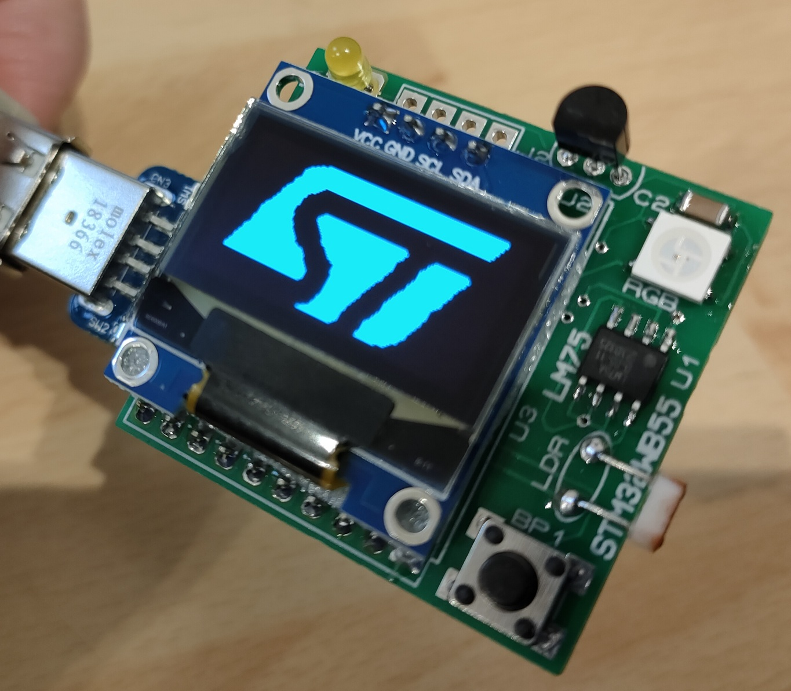
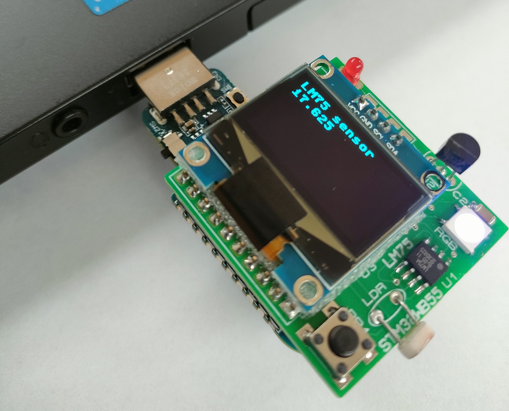
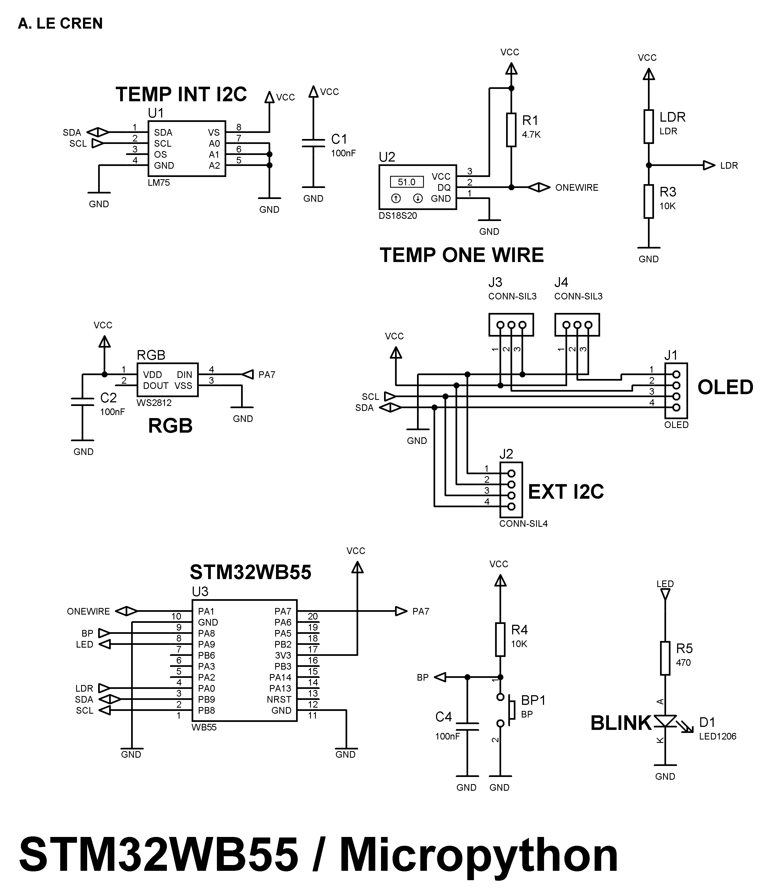
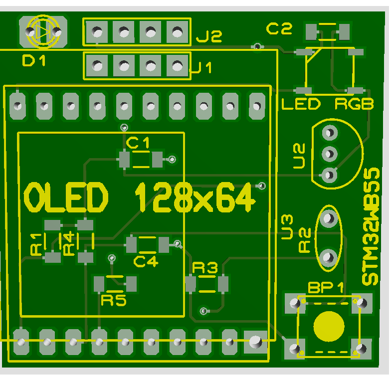

# WB55-dongle-shield

Using MicroPython in high school offers three key benefits. First, it's simple and lightweight, making it ideal for students to learn programming concepts on microcontrollers like the STM32WB55 dongle.
Second, it enables real-time experimentation with hardware, helping students bridge the gap between software and electronics. Finally, MicroPython's syntax is similar to Python, which many students already know, allowing them to quickly apply their knowledge to embedded systems.



The shield for the STM32WB55 dongle offers several advantages, particularly for laptop-based projects. It includes an OLED display, LM75 and DS18S20 temperature sensors, an LDR resistive light sensor, a push button, and an RGB WS2812b LED, providing a versatile range of components for hands-on experimentation. This setup allows students to explore various IoT and embedded applications, from environmental sensing to interactive feedback displays. Additionally, the compact dongle design connects easily to a laptop, making it highly portable and convenient for students to program and test in real time.

## STM32WB55 Dongle Shield Features

- **OLED Display**: Provides visual feedback and can display data, messages, and sensor readings.
- **Temperature Sensors**:
  - **LM75**: I2C temperature sensor for accurate temperature measurement.
  - **DS18S20**: Digital temperature sensor for precise, one-wire temperature readings.
- **LDR (Light Dependent Resistor)**: Measures ambient light levels, useful for light-sensitive applications.
- **Push Button**: User input for triggering actions or interacting with programs.
- **RGB LED (WS2812b)**: Addressable LED capable of displaying a full range of colors for visual indicators.
- **Laptop-Compatible Dongle Design**: Easily connects to a laptop, allowing for portable and real-time programming and testing.
- **Bluetooth connexion supported**
- **Thonny IDE software**



```console
MicroPython v1.24.0 on 2024-10-25; USBDongle-WB55 with STM32WB55CGU6
Type "help()" for more information.
>>> 
```

## Schematics




## PCB




## Sample program

```python 
from pyb import Pin
from time import sleep_ms

bp = Pin('A8', Pin.IN, Pin.PULL_UP)
led = Pin('A9', Pin.OUT_PP, Pin.PULL_NONE) # Broche de la LED

led.value(0)

while True :
    if bp.value() == 0:
        led.value(1)
    else:
        led.value(0)
```

## Usefull links

- [stm32python](https://stm32python.gitlab.io/fr/)

- [Micropython firmware](https://micropython.org/download/USBDONGLE_WB55/)

- [Thonny IDE](https://thonny.org/)


